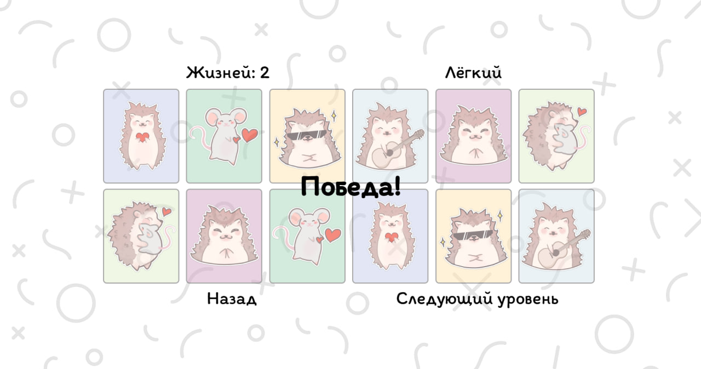
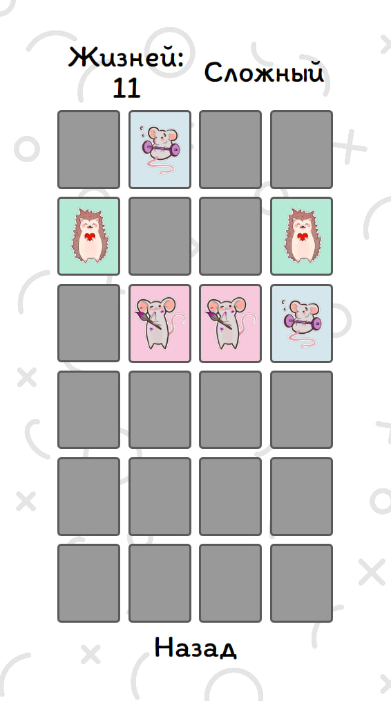
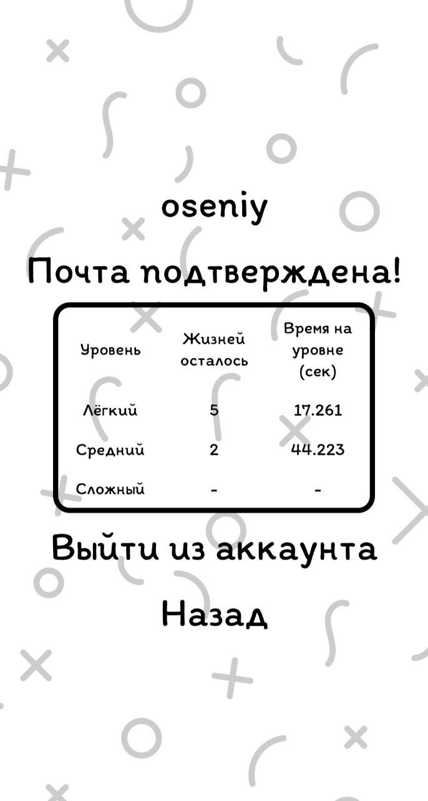
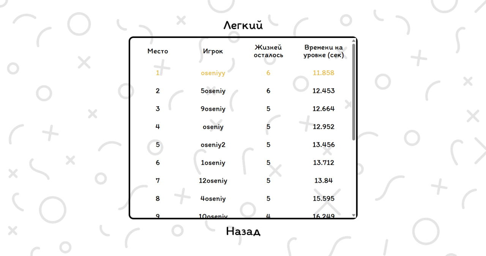

# 🧠 Memory Cards Game

Интерактивная веб-игра на запоминание, где игроку нужно находить пары одинаковых карточек.
Приложение реализовано на React, использует плавные анимации переходов, адаптивный дизайн, авторизацию через Firebase и систему рекордов для зарегистрированных пользователей.

## 🚀 Функциональность

- ✅ Адаптивный интерфейс — оптимизирован под любое соотношение сторон экрана
- 🔄 Анимации — переход между страницами, события игры и другие
- 🔐 Авторизация и регистрация через Firebase Authentication
- 🧑‍💼 Хранение данных пользователей в Firestore
- 🏆 Лидерборд — отображение лучших результатов игроков
- 🔥 Хостинг на Firebase Hosting
- 🎨 Случайная генерация карточек (комбинации цветов, картинок и их расположения) для каждой партии 
- 🎮 3 уровня сложности

## 🛠️ Технологии

* React
* React Router
* react Transition Group
* CSS Modules
* Firebase (Authentication + Firestore)
* Vite

## 📈 Скриншоты

  
  
    

## 

## 🎮 Попробовать игру

👉 [Запустить игру онлайн](https://memorycardsgame-6b7d9.web.app)  
